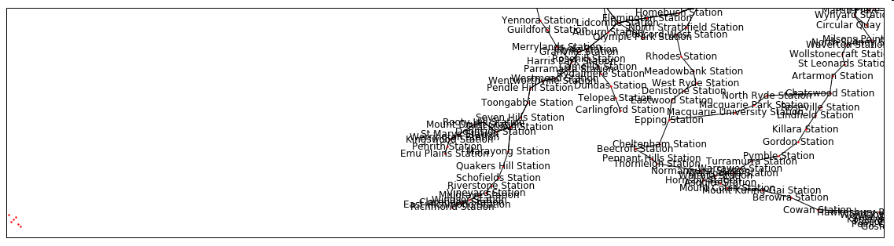

# GTFS-NetworkX
Loading GTFS data into NetworkX

I wanted to experiment with **[NetworkX]** and maps. 
To have a network to play with I decided to draw the Sydney Train network on a map.

### This Script
This script reads standard **[GTFS]** files and adds them to a [NetworkX] graph. 
That graph can then be used to analyse the data or plot the network.  
I only tested it on the Sydney Transport data, but it should work on all GTFS packages.

### NSW Transport
Transport NSW makes its timetable availabe in the Google [GTFS] format. 
A set of files can be downloaded from their [open data portal].

### Inspiration
To import the data into a NetworkX graph I used the work of **[paulgb]** as inspiration.
https://github.com/paulgb/gtfs-gexf

### Result
still work in progress

[GTFS]: https://developers.google.com/transit/gtfs/reference/
[open data portal]:https://opendata.transport.nsw.gov.au/
[paulgb]:https://github.com/paulgb/
[NetworkX]:https://networkx.github.io/
